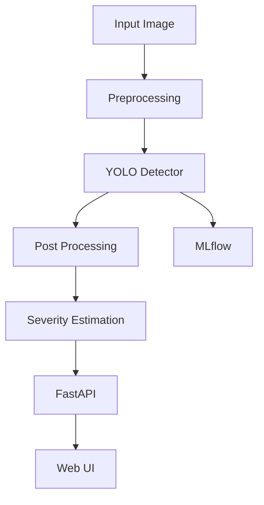

# PROJECT_SPEC.md
# Multiclass Industrial Defect Detection & Analysis
## One-Shot Build Specification for Antigravity

> **Objective:** Build a complete, runnable, portfolio-quality industrial defect detection system in one implementation pass.
>
> **Primary goal:** A working end-to-end ML + backend + MLOps MVP that can be demonstrated locally by tomorrow.
>
> **Important:** Do NOT fabricate metrics, predictions, training results, dataset statistics, deployment results, or screenshots. Every reported metric must come from an actual execution.

---

# 1. PROJECT OVERVIEW

Build an end-to-end **Multiclass Industrial Defect Detection & Analysis System**.

The system should accept an image of an industrial surface/component and:

1. preprocess the image;
2. detect one or more defect classes using a YOLO-based object detection model;
3. apply custom post-processing;
4. calculate defect confidence and approximate affected area;
5. assign a severity level;
6. return structured JSON;
7. provide a FastAPI REST API;
8. provide a simple browser UI for image upload and visualization;
9. track experiments with MLflow;
10. support Dockerized execution;
11. include automated tests;
12. include CI configuration;
13. produce a clean README and architecture documentation.

The system should be designed so that GCP deployment and a RAG-based defect assistant can be added later, but those extensions must NOT block the core build.

---

# 2. PROJECT PRINCIPLES

Follow these principles throughout implementation:

- Prefer simple, reliable technologies.
- Avoid unnecessary microservices.
- Avoid Kubernetes.
- Avoid complicated frontend frameworks unless required.
- Avoid unnecessary cloud dependencies.
- Keep the ML pipeline reproducible.
- Keep configuration separate from code.
- Use environment variables for secrets/configuration.
- Never hard-code API keys.
- Never fabricate ML metrics.
- Never claim a model was deployed to GCP unless it was actually deployed.
- Never claim a model was fine-tuned if the implementation did not actually train/fine-tune it.
- Never put fake values such as "95% accuracy" into the README.
- If a metric cannot be calculated, clearly state that it was not available.
- The application must work without internet after the required dataset/model dependencies have been downloaded.
- Use CPU-compatible defaults where practical.
- If GPU is available, automatically use it.

---

# 3. RECOMMENDED TECH STACK

## Core

- Python 3.11+
- PyTorch
- Ultralytics YOLO
- OpenCV
- NumPy
- Pandas
- scikit-learn
- Pillow

## API

- FastAPI
- Uvicorn
- Pydantic

## Experiment tracking

- MLflow

## Frontend

Prefer a very simple implementation:
- HTML
- CSS
- JavaScript

The frontend may be served by FastAPI.

Do NOT introduce React unless there is a strong reason.

## Testing

- pytest
- FastAPI TestClient

## Code quality

- pathlib
- logging
- type hints
- docstrings where useful

## Deployment

- Docker
- docker-compose

## CI

- GitHub Actions

## Optional later

- Google Cloud Run
- Google Cloud Storage
- FAISS
- sentence-transformers
- an LLM API

The optional technologies must not be required for the core project to run.

---

# 4. DATASET STRATEGY

Use a publicly available industrial defect dataset suitable for multiclass detection.

Preferred choices:

1. NEU Surface Defect Database, if bounding-box annotations can be obtained/created reliably.
2. Another publicly available industrial defect dataset with usable object-detection annotations.
3. If a selected dataset is classification-only, do NOT pretend it supports object detection.

## Critical dataset rule

The model architecture and task must match the annotations.

If the dataset has:
- bounding boxes -> train object detection;
- segmentation masks -> train segmentation;
- image-level labels only -> perform classification unless reliable bounding boxes are generated through a clearly documented process.

Do not invent annotations.

## Dataset downloader

Create:

`src/data/download_dataset.py`

It should:

- download or prepare the selected dataset;
- verify files;
- create the expected directory structure;
- print dataset statistics;
- fail with a clear error if the dataset cannot be obtained automatically.

If automatic downloading is not legally/technically possible, create a clear documented setup step and make the rest of the pipeline independent of the download mechanism.

---

# 5. EXPECTED DATA DIRECTORY

Use a YOLO-compatible structure:

```text
data/
├── raw/
├── processed/
│   ├── images/
│   │   ├── train/
│   │   ├── val/
│   │   └── test/
│   └── labels/
│       ├── train/
│       ├── val/
│       └── test/
└── dataset.yaml
```

The exact classes must be derived from the selected dataset.

Do NOT hard-code class names unless they are verified against the dataset.

---

# 6. DATA PREPARATION PIPELINE

Implement:

`src/data/prepare_dataset.py`

Requirements:

- validate image files;
- validate labels;
- detect missing images;
- detect missing labels;
- remove or report corrupted files;
- create train/validation/test splits;
- preserve class distribution where possible;
- prevent data leakage;
- generate dataset statistics;
- save a preparation report.

The preparation report should include:

- total images;
- train images;
- validation images;
- test images;
- class counts;
- invalid files;
- missing annotations;
- split percentages.

Use deterministic random seeds.

Default seed:

```text
42
```

---

# 7. DATA AUGMENTATION

Use reasonable augmentation appropriate for industrial imagery.

Possible augmentations:

- horizontal flip when semantically valid;
- vertical flip when semantically valid;
- small rotations;
- scaling;
- translation;
- brightness/contrast adjustments;
- mild noise.

Avoid aggressive transformations that destroy defect structure.

Document the chosen augmentation strategy.

---

# 8. MODEL

Use an Ultralytics YOLO model.

Prefer a lightweight model such as:

```text
YOLO11n
```

or the current stable lightweight YOLO model available in the environment.

The exact model version must be recorded in:

```text
configs/config.yaml
```

Example:

```yaml
model:
  name: yolo11n.pt
  image_size: 640
  epochs: 30
  batch_size: 16
  seed: 42
```

If GPU memory is limited:

- automatically reduce batch size;
- allow CPU training;
- allow epochs to be configured.

Do not make the implementation depend on a specific GPU.

---

# 9. TRAINING PIPELINE

Create:

`src/training/train.py`

Requirements:

- load configuration;
- load dataset;
- initialize YOLO model;
- train;
- save best model;
- save last model;
- record training parameters;
- record metrics;
- log results to MLflow;
- create a training summary.

Artifacts should be stored under:

```text
artifacts/
├── models/
├── metrics/
├── plots/
└── predictions/
```

The final best model should be copied to:

```text
artifacts/models/best.pt
```

Do not commit huge model files to Git unless explicitly requested.

---

# 10. MLFLOW

Create an MLflow experiment:

```text
industrial-defect-detection
```

Track:

- model name;
- image size;
- epochs;
- batch size;
- learning rate if available;
- optimizer if available;
- random seed;
- dataset version/hash where possible;
- precision;
- recall;
- mAP50;
- mAP50-95;
- training duration.

Store the MLflow configuration in:

```text
configs/config.yaml
```

The project should support:

```bash
mlflow ui
```

where practical.

Do not require a remote MLflow server.

Local MLflow tracking is sufficient for the MVP.

---

# 11. MODEL EVALUATION

Create:

`src/evaluation/evaluate.py`

Evaluate the trained model on the test set.

Report at minimum:

- Precision
- Recall
- mAP@50
- mAP@50:95

If supported by the model/dataset:

- per-class metrics;
- confusion matrix;
- PR curves.

Save:

```text
artifacts/metrics/evaluation.json
artifacts/plots/
```

Example JSON structure:

```json
{
  "precision": 0.0,
  "recall": 0.0,
  "map50": 0.0,
  "map50_95": 0.0,
  "per_class": {}
}
```

The zeros above are only structural examples.

Replace them with REAL values after evaluation.

---

# 12. PREDICTION PIPELINE

Create:

`src/inference/predict.py`

Input:

```text
image path
```

Output:

```python
{
    "image": "...",
    "detections": [
        {
            "class_id": 0,
            "class_name": "...",
            "confidence": 0.91,
            "bbox": {
                "x1": 10,
                "y1": 20,
                "x2": 100,
                "y2": 200
            }
        }
    ]
}
```

The inference pipeline must:

1. load model;
2. load image;
3. perform prediction;
4. apply configured confidence threshold;
5. apply NMS/model post-processing;
6. perform custom post-processing;
7. return structured results.

---

# 13. CUSTOM POST-PROCESSING

This is an important differentiator.

Create:

`src/postprocessing/defect_processor.py`

Implement:

## 13.1 Confidence filtering

Default:

```text
confidence_threshold = 0.25
```

Make configurable.

## 13.2 Duplicate suppression

Remove overlapping duplicate detections.

Use IoU:

```text
IoU = intersection_area / union_area
```

Make the IoU threshold configurable.

## 13.3 Bounding-box validation

Reject invalid boxes:

- x2 <= x1
- y2 <= y1
- coordinates outside image bounds

Clamp valid coordinates to image dimensions.

## 13.4 Defect area

Calculate:

```text
bbox_area = width × height
```

Then:

```text
area_percentage =
bbox_area / image_area × 100
```

Clearly document that bounding-box area is an approximation of affected surface area.

Do NOT call this exact physical defect area.

## 13.5 Severity

Implement a configurable rule-based severity system.

Example:

```text
area_percentage < 1%       -> Minor
1% <= area_percentage < 5% -> Moderate
area_percentage >= 5%      -> Severe
```

These are engineering heuristics, not ground-truth severity labels.

Document this clearly.

## 13.6 Aggregate result

Return:

```json
{
  "defect_count": 2,
  "defects": [],
  "overall_severity": "moderate"
}
```

Overall severity should be based on the most severe detected defect.

---

# 14. VISUALIZATION

Create:

`src/inference/visualize.py`

Generate an annotated image containing:

- bounding boxes;
- class name;
- confidence;
- severity.

Save to:

```text
artifacts/predictions/
```

Use readable labels.

Do not hard-code a specific color palette unless needed.

---

# 15. FASTAPI BACKEND

Create:

```text
api/main.py
```

Endpoints:

## GET /health

Response:

```json
{
  "status": "healthy"
}
```

## GET /model-info

Return:

- model name;
- model path;
- supported classes;
- confidence threshold.

## POST /predict

Accept:

```text
multipart/form-data
```

with:

```text
file
```

Process:

```text
upload
→ validation
→ inference
→ post-processing
→ response
```

Return:

```json
{
  "filename": "example.jpg",
  "image_width": 640,
  "image_height": 480,
  "defect_count": 2,
  "overall_severity": "moderate",
  "detections": []
}
```

## GET /docs

FastAPI's automatic Swagger documentation should work.

---

# 16. INPUT VALIDATION

Allowed formats:

- JPG
- JPEG
- PNG
- WEBP

Reject:

- unsupported formats;
- empty files;
- excessively large files.

Set a reasonable maximum file size.

Return HTTP 400 or 413 with a useful error message.

Do not expose stack traces to users.

---

# 17. MODEL LOADING

The model should load once when the API starts rather than loading for every request.

Use FastAPI lifespan/startup logic.

Bad:

```text
request
 ↓
load model
 ↓
predict
 ↓
destroy model
```

Good:

```text
server startup
 ↓
load model
 ↓
requests
 ↓
inference
```

This should be documented.

---

# 18. SIMPLE WEB UI

Create a clean single-page interface.

Requirements:

- title;
- short project description;
- image upload;
- preview;
- "Analyze Defect" button;
- loading indicator;
- annotated image;
- detected defects;
- confidence;
- area percentage;
- severity;
- error messages.

Example layout:

```text
┌───────────────────────────────────────┐
│ Industrial Defect Detection           │
│                                       │
│     [ Upload Image ]                  │
│                                       │
│     [ Analyze Defect ]                │
│                                       │
│ ┌─────────────────┐ ┌───────────────┐ │
│ │ Original Image  │ │ Result Image  │ │
│ └─────────────────┘ └───────────────┘ │
│                                       │
│ Defects: 2                            │
│ Overall Severity: Moderate            │
└───────────────────────────────────────┘
```

Do not spend excessive time on visual design.

Functionality is more important.

---

# 19. PROJECT STRUCTURE

Use:

```text
multiclass-defect-detection/
│
├── api/
│   ├── __init__.py
│   └── main.py
│
├── configs/
│   └── config.yaml
│
├── data/
│   ├── raw/
│   ├── processed/
│   └── dataset.yaml
│
├── artifacts/
│   ├── models/
│   ├── metrics/
│   ├── plots/
│   └── predictions/
│
├── frontend/
│   ├── index.html
│   ├── style.css
│   └── app.js
│
├── src/
│   ├── __init__.py
│   ├── data/
│   │   ├── __init__.py
│   │   ├── download_dataset.py
│   │   └── prepare_dataset.py
│   │
│   ├── training/
│   │   ├── __init__.py
│   │   └── train.py
│   │
│   ├── evaluation/
│   │   ├── __init__.py
│   │   └── evaluate.py
│   │
│   ├── inference/
│   │   ├── __init__.py
│   │   ├── predict.py
│   │   └── visualize.py
│   │
│   └── postprocessing/
│       ├── __init__.py
│       └── defect_processor.py
│
├── tests/
│   ├── test_postprocessing.py
│   ├── test_api.py
│   └── test_utils.py
│
├── notebooks/
│   └── exploration.ipynb
│
├── scripts/
│   ├── setup.sh
│   ├── setup.ps1
│   └── run_demo.py
│
├── .github/
│   └── workflows/
│       └── ci.yml
│
├── .gitignore
├── Dockerfile
├── docker-compose.yml
├── requirements.txt
├── requirements-dev.txt
├── README.md
├── LICENSE
└── PROJECT_SPEC.md
```

---

# 20. CONFIGURATION

Use:

`configs/config.yaml`

Example structure:

```yaml
project:
  name: multiclass-industrial-defect-detection
  seed: 42

model:
  name: yolo11n.pt
  image_size: 640
  epochs: 30
  batch_size: 16
  confidence_threshold: 0.25
  iou_threshold: 0.50

paths:
  data_dir: data
  model_dir: artifacts/models
  metrics_dir: artifacts/metrics
  predictions_dir: artifacts/predictions

mlflow:
  experiment_name: industrial-defect-detection
  tracking_uri: ./mlruns

api:
  host: 0.0.0.0
  port: 8000
  max_file_size_mb: 10

severity:
  minor_max_area_percent: 1.0
  moderate_max_area_percent: 5.0
```

The implementation may adjust the exact fields if necessary.

---

# 21. REPRODUCIBILITY

Set deterministic seeds where practical.

Use:

```text
42
```

Record:

- Python version;
- package versions;
- model version;
- dataset information;
- training parameters.

Generate:

```text
artifacts/run_metadata.json
```

---

# 22. TESTING

Implement meaningful unit tests.

At minimum test:

## Post-processing

- valid bbox;
- invalid bbox;
- confidence filtering;
- area calculation;
- severity classification;
- overlapping detections;
- empty detections.

## API

- `/health`;
- invalid file;
- valid image;
- prediction response schema.

Do not write tests that simply assert `True`.

---

# 23. CI/CD

Create:

`.github/workflows/ci.yml`

CI should:

1. install Python;
2. install dependencies;
3. run lint/basic syntax checks if configured;
4. run unit tests.

Do NOT train the full YOLO model in CI.

CI should be fast.

---

# 24. DOCKER

Create a Dockerfile.

The container should run:

```bash
uvicorn api.main:app --host 0.0.0.0 --port 8000
```

Create:

`docker-compose.yml`

Expose:

```text
8000:8000
```

The application should start with:

```bash
docker compose up --build
```

Do not require GPU Docker support for the MVP.

---

# 25. LOCAL RUN COMMANDS

README must document commands similar to:

## Create environment

```bash
python -m venv .venv
```

Windows:

```powershell
.venv\Scripts\activate
```

Linux/macOS:

```bash
source .venv/bin/activate
```

## Install dependencies

```bash
pip install -r requirements.txt
```

## Prepare dataset

```bash
python -m src.data.download_dataset
python -m src.data.prepare_dataset
```

## Train

```bash
python -m src.training.train
```

## Evaluate

```bash
python -m src.evaluation.evaluate
```

## Run API

```bash
uvicorn api.main:app --reload
```

## Run tests

```bash
pytest
```

## Run Docker

```bash
docker compose up --build
```

---

# 26. DEMO SCRIPT

Create:

`scripts/run_demo.py`

It should:

1. verify model exists;
2. locate a sample test image;
3. run inference;
4. apply post-processing;
5. save annotated output;
6. print JSON result.

Example:

```text
==============================
Industrial Defect Detection
==============================

Image: sample.jpg

Detected defects: 2

1. defect_class
   confidence: 0.91
   area: 2.4%
   severity: Moderate

2. defect_class
   confidence: 0.84
   area: 0.7%
   severity: Minor

Annotated image:
artifacts/predictions/sample_result.jpg
```

The values must be generated from the actual model.

---

# 27. README REQUIREMENTS

README.md must contain:

## 1. Project title

Multiclass Industrial Defect Detection & Analysis

## 2. Problem statement

Explain why automated defect detection is useful in industrial quality control.

## 3. Solution

Explain:

```text
Image
 ↓
YOLO
 ↓
Post-processing
 ↓
Severity estimation
 ↓
API
 ↓
Web UI
```

## 4. Architecture

Include a Mermaid diagram if supported:



## 5. Dataset

Clearly identify the actual dataset used.

## 6. Model

Explain:

- model;
- training;
- inference;
- augmentation.

## 7. Evaluation

Include only REAL metrics.

## 8. Post-processing

Explain:

- confidence filtering;
- IoU;
- duplicate removal;
- area estimation;
- severity.

## 9. API

Document endpoints.

## 10. Docker

Explain how to run.

## 11. MLflow

Explain experiment tracking.

## 12. Testing

Show test command and result only if actually executed.

## 13. Limitations

Explicitly mention:

- dataset limitations;
- bounding-box area is an approximation;
- severity is heuristic unless severity labels exist;
- performance depends on image quality;
- model may not generalize to unseen manufacturing environments.

## 14. Future work

Mention:

- GCP deployment;
- model monitoring;
- segmentation;
- RAG defect assistant;
- active learning;
- human-in-the-loop review.

---

# 28. OPTIONAL GCP SUPPORT

If time permits, prepare the application for GCP Cloud Run.

Requirements:

- Docker image must be Cloud Run compatible;
- port must be configurable through `$PORT`;
- no local filesystem dependency for persistent data;
- configuration through environment variables.

Do NOT claim deployment unless actually performed.

If deployment is successfully tested, document:

- service architecture;
- deployment command;
- endpoint;
- limitations.

---

# 29. OPTIONAL RAG EXTENSION

This is NOT required for the first working version.

If the core system is complete, create:

```text
rag/
├── ingest.py
├── retrieve.py
└── generate.py
```

Purpose:

Given a detected defect:

```text
defect = "scratch"
```

retrieve relevant quality-control documentation and generate:

- defect explanation;
- possible causes;
- recommended inspection;
- recommended corrective action.

Pipeline:

```text
Detected Defect
      ↓
Embedding
      ↓
Vector Search
      ↓
Relevant Documents
      ↓
LLM
      ↓
Grounded Explanation
```

Use FAISS or another lightweight local vector store.

Use sentence-transformers for embeddings.

The RAG system must clearly indicate that generated recommendations are suggestions and should not be treated as authoritative manufacturing instructions.

---

# 30. SECURITY

Implement basic security hygiene:

- validate uploaded file type;
- limit file size;
- never execute uploaded files;
- sanitize filenames;
- do not expose secrets;
- use environment variables;
- do not commit `.env`;
- do not expose internal exceptions.

---

# 31. PERFORMANCE

Measure inference latency locally.

Record:

```text
average inference time
```

over a small test set.

Do not fabricate latency.

If measured, report:

- CPU/GPU used;
- image size;
- number of samples;
- average latency.

---

# 32. LOGGING

Use Python's logging module.

Log:

- application startup;
- model loading;
- inference request;
- prediction count;
- errors.

Do not log sensitive file contents.

---

# 33. ERROR HANDLING

The API should handle:

- missing model;
- corrupted image;
- unsupported image format;
- oversized image;
- empty image;
- inference failure.

Return useful errors such as:

```json
{
  "error": "Invalid image format. Supported formats: JPG, JPEG, PNG, WEBP."
}
```

---

# 34. CODE QUALITY

Use:

- functions with clear responsibilities;
- type hints;
- modular files;
- configuration instead of magic numbers;
- reusable utilities;
- clear naming.

Avoid:

- huge single files;
- duplicated code;
- hard-coded absolute paths;
- hidden global state;
- unnecessary abstractions.

---

# 35. IMPORTANT ONE-SHOT EXECUTION STRATEGY

Antigravity should implement the project in this order:

### STEP 1

Inspect the repository and environment.

### STEP 2

Create the project structure.

### STEP 3

Create configuration.

### STEP 4

Implement dataset preparation.

### STEP 5

Verify dataset structure.

### STEP 6

Implement YOLO training.

### STEP 7

Actually train a model if computationally feasible.

### STEP 8

Evaluate the model.

### STEP 9

Implement inference.

### STEP 10

Implement post-processing.

### STEP 11

Implement visualization.

### STEP 12

Implement FastAPI.

### STEP 13

Implement frontend.

### STEP 14

Implement tests.

### STEP 15

Run tests.

### STEP 16

Create Docker configuration.

### STEP 17

Test Docker build.

### STEP 18

Integrate MLflow.

### STEP 19

Create CI workflow.

### STEP 20

Run a complete end-to-end demo.

### STEP 21

Fix all errors.

### STEP 22

Generate README.

### STEP 23

Generate final project report.

Do not stop after creating files.

The project is considered incomplete until the implementation has been executed and validated.

---

# 36. COMPUTATIONAL CONSTRAINT

The user needs a working MVP quickly.

Therefore:

- choose a lightweight YOLO model;
- use modest image resolution;
- use configurable epochs;
- use CPU fallback;
- avoid massive datasets;
- avoid huge foundation models;
- avoid Kubernetes;
- avoid distributed training;
- avoid unnecessary microservices.

If full training cannot complete in the available environment, do NOT fabricate the results.

Instead:

1. implement the complete training pipeline;
2. run a short smoke-training job if possible;
3. clearly identify what was successfully executed;
4. document the command needed for full training.

---

# 37. NO FAKE RESULTS POLICY

This is mandatory.

NEVER write:

```text
Accuracy: 95%
mAP: 94%
F1: 93%
Latency: 50ms
```

unless the number was obtained by executing the actual pipeline.

Never invent:

- dataset size;
- number of classes;
- model accuracy;
- mAP;
- precision;
- recall;
- latency;
- deployment success;
- number of users;
- cost savings.

If an actual metric is obtained, store it in:

```text
artifacts/metrics/
```

and reference that result in README.

---

# 38. ACCEPTANCE CRITERIA

The project is DONE only if the following are true:

## Dataset

- [ ] Dataset is real and documented.
- [ ] Dataset annotations match the ML task.
- [ ] Dataset preparation runs.
- [ ] Train/val/test split exists.

## Model

- [ ] YOLO model configuration exists.
- [ ] Training script runs.
- [ ] Best model is saved.
- [ ] Evaluation script runs.
- [ ] Real metrics are saved.

## Inference

- [ ] An image can be passed to the model.
- [ ] Detections are returned.
- [ ] Confidence is returned.
- [ ] Bounding boxes are returned.
- [ ] Post-processing runs.
- [ ] Severity is calculated.

## API

- [ ] FastAPI starts.
- [ ] `/health` works.
- [ ] `/model-info` works.
- [ ] `/predict` works.
- [ ] Swagger documentation works.

## UI

- [ ] Image upload works.
- [ ] Prediction works from browser.
- [ ] Annotated result is displayed.
- [ ] Detection information is visible.

## MLOps

- [ ] MLflow integration exists.
- [ ] Training parameters are tracked.
- [ ] Evaluation metrics are tracked.
- [ ] Docker build works.
- [ ] CI workflow exists.

## Testing

- [ ] Unit tests exist.
- [ ] API tests exist.
- [ ] Tests actually run.

## Documentation

- [ ] README exists.
- [ ] Architecture is documented.
- [ ] Setup commands are documented.
- [ ] API is documented.
- [ ] Limitations are documented.
- [ ] No fake metrics are present.

---

# 39. FINAL DELIVERABLES

At completion, the repository must contain:

1. Working ML training pipeline.
2. Working evaluation pipeline.
3. Working inference pipeline.
4. Custom post-processing.
5. FastAPI service.
6. Simple web UI.
7. Docker configuration.
8. MLflow integration.
9. Automated tests.
10. GitHub Actions CI.
11. Dataset preparation scripts.
12. Sample prediction output.
13. README.
14. Architecture diagram.
15. Configuration file.
16. Requirements files.
17. `.gitignore`.
18. This PROJECT_SPEC.md.

---

# 40. FINAL RESPONSE FROM ANTIGRAVITY

After implementation, provide a concise final report containing:

## Implementation status

What was completed.

## Dataset

Exact dataset used.

## Model

Exact model used.

## Training

Whether actual training was completed.

## Evaluation

Only actual metrics.

## API

Available endpoints.

## Docker

Whether Docker build/run was tested.

## Tests

Number of tests and actual result.

## MLflow

Whether experiment tracking was verified.

## Known limitations

Anything unfinished or environment-dependent.

## Run commands

Exact commands to start the project.

## Next recommended improvements

List only realistic next steps.

---

# 41. FINAL INSTRUCTION TO ANTIGRAVITY

You are acting as the primary implementation engineer.

Do not merely generate a skeleton.

Build the complete working MVP described in this specification.

You have permission to create, modify, and organize project files inside the project directory.

Prioritize:

1. correctness;
2. working end-to-end execution;
3. reproducibility;
4. simplicity;
5. clean architecture;
6. testability;
7. documentation.

If you encounter an implementation problem:

1. diagnose it;
2. fix it;
3. rerun the affected component;
4. continue.

Do not hide errors.

Do not replace real implementation with placeholders merely to make the project appear complete.

Do not fabricate results.

Do not claim success without executing the relevant command.

At the end, perform a complete smoke test:

```text
dataset/model
      ↓
inference
      ↓
post-processing
      ↓
FastAPI
      ↓
browser/API request
      ↓
prediction
      ↓
annotated image
```

The final repository must be understandable to a developer who has never seen the project before.

# END OF PROJECT SPECIFICATION
