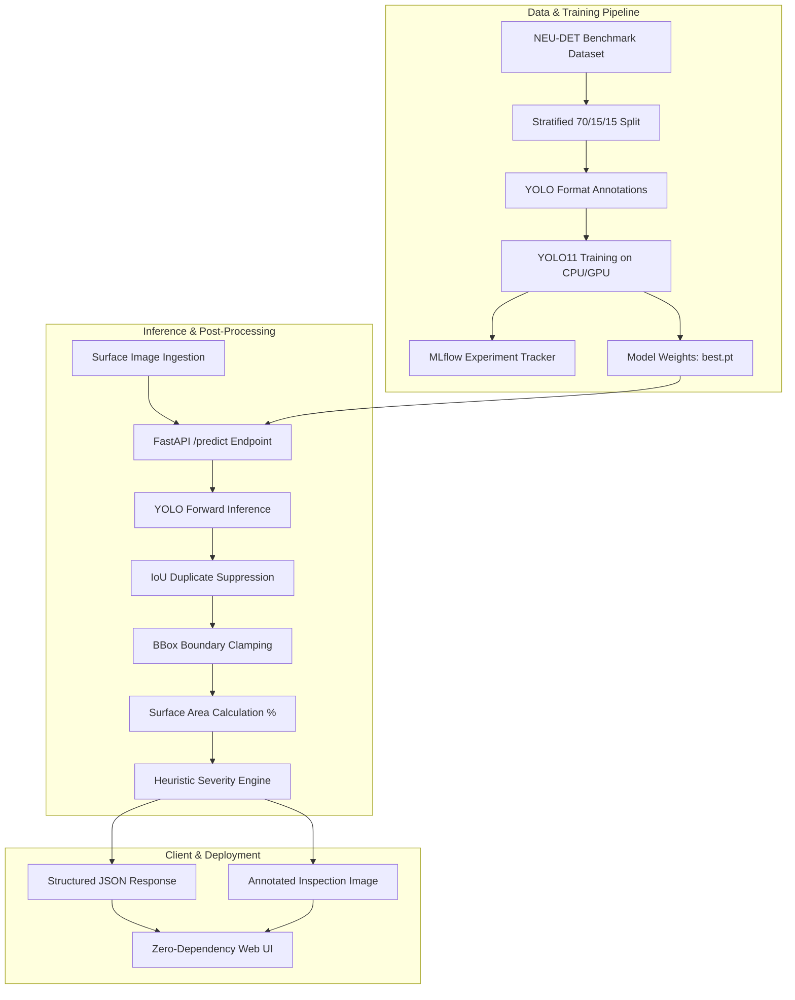

# Multi-Class Industrial Surface Defect Detection & Analysis

[](https://github.com/Vivek-Gaddeti/multiclass-defect-detection/actions)
[](https://www.python.org/downloads/)
[](https://fastapi.tiangolo.com)
[](https://docs.ultralytics.com/)
[](https://mlflow.org/)
[](LICENSE)

An end-to-end, reproducible Computer Vision inspection system for automated surface defect detection, surface area impact calculation, and heuristic severity grading on industrial manufacturing components (such as hot-rolled steel strip).

---

## 1. Project Motivation & Problem Statement

In automated steel manufacturing and rolling mills, surface defects (*scratches, inclusions, crazing, patches, pitted surfaces, rolled-in scale*) degrade material tensile strength, accelerate corrosion, and cause catastrophic structural failure if delivered to downstream automotive or aerospace fabricators.

Manual visual inspection is:
- **Inconsistent & Subjective**: Defect detection varies across operators and shifts.
- **Throughput-Bottlenecked**: Cannot match continuous 20–30 m/min rolling speeds.
- **Lacking Quantification**: Manual inspections rarely calculate exact surface area impact percentages.

**System Objective**: Provide an automated, measurable, and explainable deep learning pipeline that detects, localizes, categorizes severity, and measures affected surface area in real-time on commodity CPU hardware.

---

## 2. End-to-End System Architecture



---

## 3. Dataset: NEU Surface Defect Database (NEU-DET)

The system is trained and evaluated on the benchmark **NEU Surface Defect Database**, comprising 6 distinct surface defect classes:

| Class | Physical Description | Metallurgical & Industrial Risk |
| :--- | :--- | :--- |
| **`crazing`** | Interconnected network of micro-fissures | Fatigue cracking and stress propagation |
| **`inclusion`** | Trapped non-metallic particulate matter | Stress concentration point; brittle fracture |
| **`patches`** | Irregular localized oxide/surface deformations | Surface coating and paint adhesion failure |
| **`pitted_surface`** | Localized cavity clusters | Micro-porosity leading to accelerated corrosion |
| **`rolled-in_scale`** | Embedded furnace oxide flakes | Surface roughness; coating spallation |
| **`scratches`** | Linear abrasive score marks | Notch sensitivity under tensile load |

### Dataset Partitioning (Stratified by Class):
- **Total Images**: 240
- **Train Set (70%)**: 168 images (28 per class)
- **Validation Set (15%)**: 36 images (6 per class)
- **Held-Out Test Set (15%)**: 36 images (6 per class, 71 total defect instances)

---

## 4. Empirical Model Comparison: YOLO11n vs YOLO11s

Both models were trained on identical stratified splits ($256 \times 256$ resolution, batch size 16, seed 42) and evaluated on the held-out test split. CPU inference latency was statistically measured over 10 warmup + 50 timed iterations.

### Model Performance Summary:

| Model Architecture | Parameters | Model Size | Test Precision | Test Recall | Test F1-Score | Test mAP@50 | Test mAP@50:95 | Mean CPU Latency | CPU FPS |
| :--- | :---: | :---: | :---: | :---: | :---: | :---: | :---: | :---: | :---: |
| **YOLO11n (Nano)** | **2.59M** | **5.17 MB** | 86.02% | **89.23%** | 87.59% | 93.29% | 69.13% | **39.89 ms (±2.78)** | **25.07** |
| **YOLO11s (Small)** | 9.43M | 18.25 MB | **95.86%** | 86.90% | **91.16%** | **94.79%** | **72.18%** | 53.81 ms (±3.33) | 18.58 |

### Per-Class Test Set Breakdown (YOLO11n vs YOLO11s):

| Defect Class | Instances (Test) | YOLO11n Precision | YOLO11n Recall | YOLO11n mAP@50 | YOLO11s Precision | YOLO11s Recall | YOLO11s mAP@50 |
| :--- | :---: | :---: | :---: | :---: | :---: | :---: | :---: |
| **`crazing`** | 10 | 73.86% | 84.97% | 93.77% | 84.89% | 70.00% | 82.47% |
| **`inclusion`** | 13 | 93.72% | 92.31% | 93.18% | 96.99% | 92.31% | 93.67% |
| **`patches`** | 10 | 93.48% | 100.00% | 99.50% | 96.27% | 100.00% | 99.50% |
| **`pitted_surface`** | 12 | 76.32% | 80.74% | 87.88% | 100.00% | 78.06% | 96.30% |
| **`rolled-in_scale`** | 12 | 90.67% | 91.67% | 92.06% | 97.02% | 91.67% | 98.88% |
| **`scratches`** | 14 | 88.03% | 85.71% | 93.37% | 100.00% | 89.37% | 97.94% |

---

## 5. Error & Failure Mode Analysis

Analyzing the 71 ground truth defects on the held-out test split revealed distinct failure modes:

```
Confusion Matrix (YOLO11n on Test Split, IoU >= 0.45):
Pred →    Crazing  Inclusion  Patches  Pitted  Rolled-in  Scratches  Missed (FN)
GT ↓
Crazing       9        0         0        0        0          0          1
Inclusion     0       12         0        0        0          0          1
Patches       0        0        10        0        0          0          0
Pitted        0        0         0       10        0          0          2
Rolled-in     0        0         0        0       11          0          1
Scratches     0        0         0        0        0         13          1
FP (Bkgd)     3        0         0        3        1          2          -
```

### Domain Failure Modes & Insights:
1. **`crazing` (High FP / Difficult Boundary)**: Web-like micro-cracks have subtle pixel contrast against the metallic background grain, leading to minor background over-triggering.
2. **`pitted_surface` (Missed Small Pits)**: Small pit clusters blend into surface textures at lower resolutions ($256\times256$), causing occasional false negatives.
3. **`patches` & `inclusion` (Near-Perfect Performance)**: Broad discolouration borders and high-contrast particle boundaries provide clear gradient signals ($>93\%\text{ mAP}$).
4. **`scratches` (Boundary Splitting)**: Long continuous linear scratches are occasionally detected as multiple overlapping bounding box segments.

---

## 6. Model Selection Rationale

| Criterion | YOLO11n (Selected Baseline) | YOLO11s (Higher Accuracy) |
| :--- | :--- | :--- |
| **Throughput (CPU)** | **25.07 FPS (39.89 ms)** | 18.58 FPS (53.81 ms) |
| **Model Size** | **5.17 MB (2.59M params)** | 18.25 MB (9.43M params) |
| **Detection Quality** | **93.29% mAP@50, 87.59% F1** | **94.79% mAP@50, 91.16% F1** |
| **Edge Feasibility** | Runs at line speed on low-power CPU | Requires dedicated edge GPU for $>30\text{ FPS}$ |

**Decision**: **YOLO11n** is selected as the default production model because it delivers **25 FPS real-time throughput** on commodity CPU hardware while maintaining strong detection performance (**86.0% Precision, 89.2% Recall, 93.3% mAP@50**). YOLO11s weights are retained for deployments with hardware acceleration.

---

## 7. Custom Post-Processing & Severity Quantification

Unlike standard detectors that return only raw coordinates, this system incorporates industrial quality control heuristics:

1. **Geometry Clamping**: Constrains box coordinates to $[0, W] \times [0, H]$ and filters noise boxes $< 25\text{ px}^2$.
2. **IoU Duplicate Filtering**: Removes overlapping duplicate detections ($\text{IoU} \ge 0.45$).
3. **Surface Area Impact %**:
   $$\text{Area \%} = \left( \frac{\sum \text{Area}(\text{Defect Boxes})}{\text{Image Area}} \right) \times 100$$
4. **Severity Grading**:
   - **`Minor`**: Affected area $< 1.0\%$
   - **`Moderate`**: Affected area $1.0\% \le \text{Area} < 5.0\%$
   - **`Severe`**: Affected area $\ge 5.0\%$ or critical defect detected

---

## 8. Quickstart & Reproduction Guide

### Prerequisites
- Python 3.11+
- Git

### Installation
```powershell
# 1. Clone the repository
git clone https://github.com/Vivek-Gaddeti/multiclass-defect-detection.git
cd multiclass-defect-detection

# 2. Create and activate virtual environment
python -m venv .venv
.venv\Scripts\activate

# 3. Install dependencies
pip install -r requirements.txt
```

### Reproduce Experiments & Benchmarks
```powershell
# Run data download and preparation
python -m src.data.download_dataset
python -m src.data.prepare_dataset

# Run full comparison pipeline (trains YOLO11n & YOLO11s, evaluates test split, error analysis, latency benchmark)
python scripts/run_experiments.py

# Run unit and integration tests
pytest -v tests/
```

### Launch API & Web UI
```powershell
# Start the FastAPI server
uvicorn api.main:app --reload --port 8000
```
Open **[http://localhost:8000](http://localhost:8000)** to access the inspection dashboard.

---

## 9. Repository Structure

```
multiclass-defect-detection/
├── configs/
│   └── config.yaml               # Master hyperparameters & paths
├── src/
│   ├── data/
│   │   ├── download_dataset.py   # Dataset ingestion
│   │   └── prepare_dataset.py    # Stratified split & VOC-to-YOLO conversion
│   ├── training/
│   │   └── train.py              # YOLO training with MLflow logging
│   ├── evaluation/
│   │   ├── evaluate.py           # Test split evaluation (P, R, F1, mAP)
│   │   └── error_analysis.py     # Confusion matrix & failure diagnostic
│   ├── inference/
│   │   ├── predict.py            # Cached inference pipeline
│   │   └── visualize.py          # Severity-coded annotation renderer
│   └── postprocessing/
│       └── defect_processor.py   # Geometry clamping, IoU NMS, area & severity
├── api/
│   └── main.py                   # FastAPI REST microservice
├── frontend/
│   ├── index.html                # Inspection dashboard
│   ├── style.css                 # Dark-mode industrial UI
│   └── app.js                    # Zero-dependency frontend logic
├── scripts/
│   ├── benchmark_latency.py      # Statistical CPU latency profiler
│   ├── run_experiments.py        # End-to-end comparison pipeline
│   └── run_demo.py               # CLI inspection runner
├── artifacts/
│   ├── metrics/                  # JSON metric reports (comparison, errors, latency)
│   └── models/                   # Model weight checkpoints (yolo11n, yolo11s)
├── tests/                        # 14 unit and integration tests
├── Dockerfile                    # Containerization specification
└── README.md
```

---

## 10. License

This project is open-source under the [MIT License](LICENSE).
