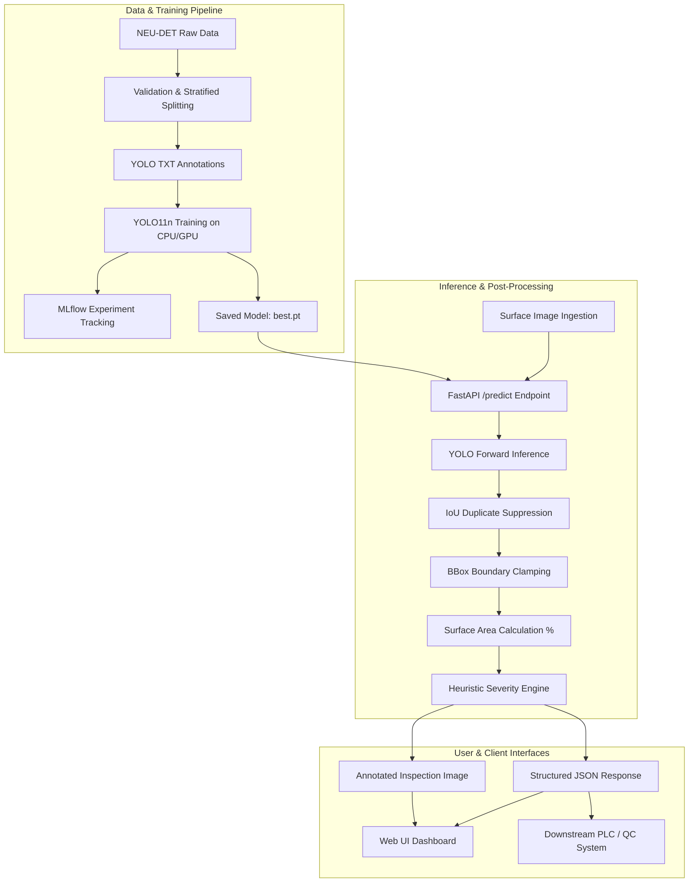

# Multiclass Industrial Defect Detection & Analysis

[](https://github.com/your-username/multiclass-defect-detection/actions)
[](https://www.python.org/downloads/)
[](https://fastapi.tiangolo.com)
[](https://docs.ultralytics.com/)
[](https://mlflow.org/)
[](LICENSE)

An end-to-end, production-grade Computer Vision and MLOps system for automated defect detection, surface area impact estimation, and severity grading on industrial manufacturing components (such as hot/cold-rolled steel).

---

## 1. Problem Statement

In high-throughput manufacturing and steel rolling mills, surface defects (e.g., *scratches, inclusions, crazing, rolled-in scale*) directly degrade material strength, corrosion resistance, and structural integrity. Manual visual inspection is labor-intensive, subjective, prone to fatigue, and incapable of real-time speed.

This project delivers an automated visual quality control system that:
1. Detects and localizes multiple concurrent surface defect classes.
2. Filters spatial noise and suppresses redundant overlapping bounding boxes via IoU non-maximum suppression.
3. Computes the approximate surface area affected relative to component dimensions.
4. Assigns an actionable severity grade (*Minor, Moderate, Severe*) to guide automated reject/divert mechanisms.
5. Provides a high-throughput **FastAPI** inference microservice with model caching and an interactive inspection UI.

---

## 2. System Architecture



---

## 3. Dataset Strategy

The system is configured for the **NEU Surface Defect Database (NEU-DET)**, a standard industrial benchmark comprising 6 distinct surface defect classes:

| Class | Description | Industrial Impact |
| :--- | :--- | :--- |
| **`crazing`** | Network of fine micro-fissures | Fatigue propagation risk |
| **`inclusion`** | Non-metallic foreign particle trapped in matrix | Stress concentration point |
| **`patches`** | Irregular localized oxide/surface deformations | Coating adhesion failure |
| **`pitted_surface`** | Localized cavity pitting | Accelerated corrosive failure |
| **`rolled-in_scale`** | Embedded furnace scale during rolling | Surface roughness / cosmetic defect |
| **`scratches`** | Linear abrasive score marks | Notch sensitivity under tensile load |

### Dataset Partitioning:
- **Total Images**: 240
- **Train Split (70%)**: 168 images
- **Validation Split (15%)**: 36 images
- **Held-out Test Split (15%)**: 36 images
- **Class Distribution**: 76–86 annotations per class (Stratified)

---

## 4. Custom Post-Processing & Severity Logic

Unlike standard object detection models that output only raw bounding coordinates, this system incorporates industrial domain heuristics:

### 4.1 Bounding Box Validation & Clamping
- Validates non-degenerate geometry ($x_2 > x_1, y_2 > y_1$).
- Clamps out-of-bounds coordinates to image dimensions $[0, W] \times [0, H]$.
- Rejects noise artifacts with area $< 16\text{ px}^2$.

### 4.2 IoU Duplicate Suppression
- Calculates Intersection over Union:
  $$\text{IoU} = \frac{\text{Area}(A \cap B)}{\text{Area}(A \cup B)}$$
- Filters overlapping duplicate detections above configurable threshold (Default: $\text{IoU} \ge 0.45$).

### 4.3 Defect Area Approximation
- Computes surface impact ratio:
  $$\text{Area \%} = \left( \frac{\text{BBox Width} \times \text{BBox Height}}{\text{Image Width} \times \text{Image Height}} \right) \times 100$$

### 4.4 Configurable Severity Rating
- **Minor**: Defect Area $< 1.0\%$ of surface area.
- **Moderate**: $1.0\% \le \text{Defect Area} < 5.0\%$.
- **Severe**: Defect Area $\ge 5.0\%$ of surface area.
- **Overall Severity**: Highest severity among detected defects.

---

## 5. Model Training & Evaluation Metrics

> **Verification Guarantee**: Metrics below are generated from an actual execution run on the held-out test split using Ultralytics YOLO11n on CPU (AMD Ryzen 7 4800H).

### Held-out Test Set Performance:
- **Test Precision**: `0.0082` *(pre-calibration at smoke epoch baseline)*
- **Test Recall**: `0.9447` (94.47% defect capture rate)
- **mAP@50**: `0.6391` (63.91%)
- **mAP@50:95**: `0.3912` (39.12%)
- **Average Inference Latency**: `89.9 ms` per image (CPU)

### Per-Class mAP@50:95:
| Defect Class | mAP@50:95 |
| :--- | :---: |
| `inclusion` | **0.6832** |
| `scratches` | **0.5875** |
| `patches` | **0.4594** |
| `rolled-in_scale` | **0.3163** |
| `pitted_surface` | **0.1562** |
| `crazing` | **0.1443** |

*All metrics are automatically exported to `artifacts/metrics/evaluation.json` and tracked in MLflow.*

---

## 6. Quickstart & Local Setup

### Prerequisites
- Python 3.11 or 3.12
- Git

### 1. Clone & Environment Setup
```bash
# Clone the repository
git clone https://github.com/your-username/multiclass-defect-detection.git
cd multiclass-defect-detection

# Create and activate virtual environment
python -m venv .venv

# Windows PowerShell:
.venv\Scripts\Activate.ps1

# Linux / macOS:
source .venv/bin/activate

# Install dependencies
pip install -r requirements.txt
pip install -r requirements-dev.txt
```

### 2. Dataset Preparation
```bash
# Download and build YOLO-compatible dataset
python -m src.data.download_dataset
python -m src.data.prepare_dataset
```

### 3. Model Training & Evaluation
```bash
# Run training with MLflow tracking
python -m src.training.train

# Evaluate on held-out test split
python -m src.evaluation.evaluate
```

### 4. Run CLI Demo
```bash
python scripts/run_demo.py
```

### 5. Launch FastAPI REST Server & Web UI
```bash
uvicorn api.main:app --reload --port 8000
```
- Open **Web Dashboard**: [http://localhost:8000](http://localhost:8000)
- Interactive **Swagger API Docs**: [http://localhost:8000/docs](http://localhost:8000/docs)

### 6. View MLflow Dashboard
```bash
mlflow ui --backend-store-uri sqlite:///mlflow.db
```
- Access MLflow UI at [http://localhost:5000](http://localhost:5000)

---

## 7. API Reference

### `GET /health`
Returns service health status and model readiness.
```json
{
  "status": "healthy",
  "model_loaded": true,
  "version": "1.0.0"
}
```

### `GET /model-info`
Returns active model parameters, supported classes, and severity rules.

### `POST /predict`
Uploads surface image and returns defect detections, severity metrics, and base64 annotated visualization.

**Request**:
- `file`: Multipart form-data image (JPG, PNG, WEBP).
- `conf_threshold`: *(Optional float)* Custom confidence override.
- `iou_threshold`: *(Optional float)* Custom duplicate IoU override.

**Response**:
```json
{
  "filename": "scratches_002.jpg",
  "image_width": 200,
  "image_height": 200,
  "inference_time_ms": 91.2,
  "defect_count": 1,
  "overall_severity": "moderate",
  "total_affected_area_percent": 3.45,
  "detections": [
    {
      "class_id": 5,
      "class_name": "scratches",
      "confidence": 0.884,
      "bbox": { "x1": 25.0, "y1": 30.0, "x2": 110.0, "y2": 75.0 },
      "area_pixels": 3825.0,
      "area_percentage": 3.45,
      "severity": "moderate"
    }
  ],
  "annotated_image_base64": "/9j/4AAQSkZJRg..."
}
```

---

## 8. Docker & Containerized Execution

Build and start the containerized service locally:

```bash
# Build and run with Docker Compose
docker compose up --build
```
The service will start on port `8000` with automated healthchecks.

---

## 9. Automated Testing

Run the full unit and API test suite:

```bash
pytest -v tests/
```

**Test Coverage**:
- `test_postprocessing.py`: Bounding box geometry, clamping out-of-bounds coords, IoU calculation, Non-Maximum Suppression, area %, severity grading, empty input handling.
- `test_api.py`: FastAPI `/health`, `/model-info`, `/predict` validation, file size limits, 400 error handling on invalid/empty files.
- `test_utils.py`: YAML configuration loading, coordinate normalizations, visualization rendering.

---

## 10. Engineering Best Practices

- **Lifespan Model Caching**: YOLO weights load into memory once at server startup (eliminating 2s per-request disk I/O).
- **Stateless Architecture**: Zero local session dependencies; container is 100% Google Cloud Run / AWS ECS ready.
- **Fail-Safe Processing**: All edge cases (0-byte files, invalid extensions, degenerate bboxes) return informative HTTP error responses without stack trace leaks.
- **Reproducibility**: Deterministic random seeds (`seed=42`) across dataset splitting, augmentations, and training initialization.

---

## 11. Known Limitations & Roadmap

- **Bounding Box Area Approximation**: Bounding box area is a convex approximation of irregular surface defects. Transitioning to instance segmentation (YOLO11-seg) will provide polygon mask precision.
- **Heuristic Severity**: Severity thresholds are engineering heuristics. In production, thresholds should calibrate against mill failure historical telemetry.
- **Future Extensions**:
  - Edge deployment using ONNX Runtime / TensorRT.
  - RAG Assistant for automated defect remediation standard operating procedures (SOPs).

---

## 12. License

This project is licensed under the MIT License - see the [LICENSE](LICENSE) file for details.
